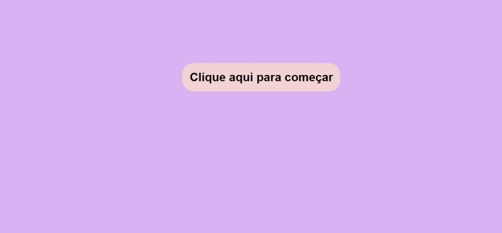

# ReactContenxt
Projeto desenvolvido como desafio dos 21 dias de programação da rocketseat

## 🎯Objetivo do projeto:
Criar uma aplicação aonde seria capturado o evento de teclado do usuario e seria exibido na tela a tecla pressionada

## ✏️ Resultado final:

[Resultado final](https://key-capture-sigma.vercel.app/)

## ⚒️ Tecnologias utilizadas:

- ReactJs;
- TypeScript;
- JavaScript;
- HTML5;
- SCSS;
